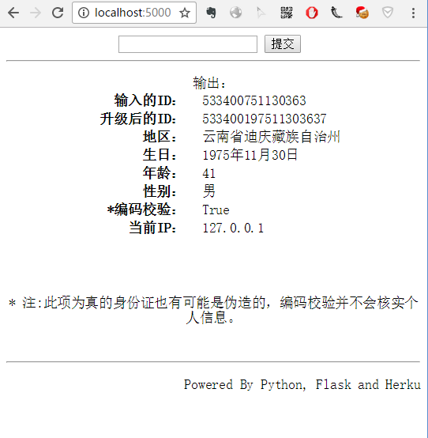

一个解析中国居民身份证号码的程序。

-----------------------------------

它可以做什么?

1. 查询一个身份号的居民户口所在地、年龄、性别。

   并简单校验一个身份证号是否是胡编乱造的。

2. 15位旧身份证号码升级为18位二代身份证号。

------------------------------

使用它：

1. 你可以运行app.py，访问localhost:5000端口。这是一个使用Flask的web应用。 
2. 你可以单独使用ID.py模块，使用decode_id函数解析身份证号，update函数升级身份证号。

-----------------

依赖：

Flask

